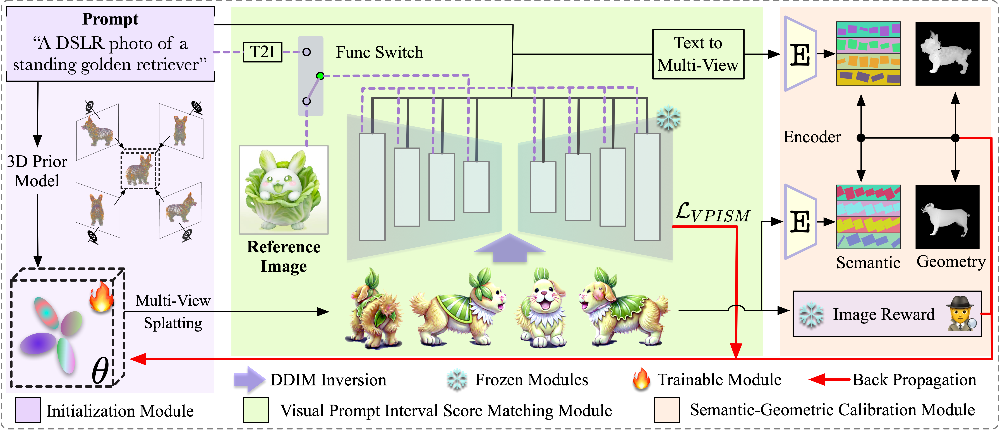
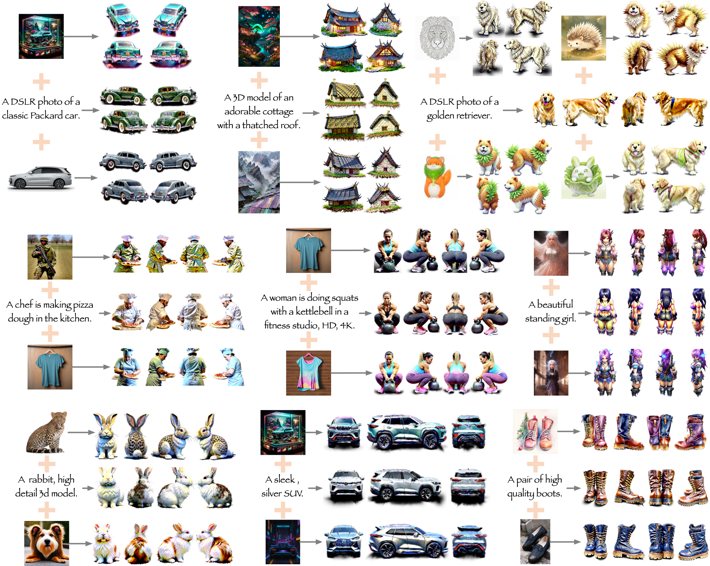

<div align="center">

# TV-3DG: Mastering Text-to-3D Customized Generation with Visual Prompt

Jiahui Yang, Yongjia Ma, Wenzhang Sun, Donglin Di, Chaofan Luo, Wei Chen, Xun Yang*, Jianxun Cui*
<!-- <p align="center">
<a href=""></a>
</p> -->
</div> 
<p align="center">
    
</p>
**Abstract:** *Recent advancements in the text-to-3D field have been substantial. However, the inherent ambiguity of text prompts continues to pose a significant challenge in producing customized 3D assets. While subsequent works have explored using images as conditions to enhance 3D controllability, they still struggle to generating high-quality and customized 3D assets. To address this challenge, we introduce TV- 3DG, a novel customized generation framework that leverages text descriptions and single image guidance to produce high- quality and intricately stylized 3D assets. Our foundational insight stems from pioneering advancements in diffuse models, incorporating a 3D prior model for coarse model initialization, a Visual Prompt Interval Score Matching (VPISM) module for aligning the style and content of the generated 3D asset with the given image and text prompt, and a Semantic-Geometry Calibration (SGC) module for matching the semantic and geometric distribution of 3D rendered images to the text prompt distributions.*

<p align="center">
    
</p>

Visual results of <b>TV-3DG</b> with various customized text and reference visual prompts.
We extend our gratitude to the Civitai community for providing some of the intricate reference images.


## Acknowledgements

We are deeply thankful to the authors of the following works, which have significantly inspired our project:
- [IP-Adapter](https://github.com/tencent-ailab/IP-Adapter)
- [LucidDreamer](https://github.com/EnVision-Research/LucidDreamer)
- [LGM](https://github.com/3DTopia/LGM) & [Point-E](https://github.com/openai/point-e)
- [MVEdit](https://github.com/Lakonik/MVEdit) & [IPDreamer](https://github.com/zengbohan0217/IPDreamer)
- [3D Gaussian Splatting](https://github.com/graphdeco-inria/gaussian-splatting)
- [Threestudio](https://github.com/threestudio-project/threestudio)


# Citation
```shell
@article{
      title={TV-3DG: Mastering Text-to-3D Customized Generation with Visual Prompt}, 
}
```

